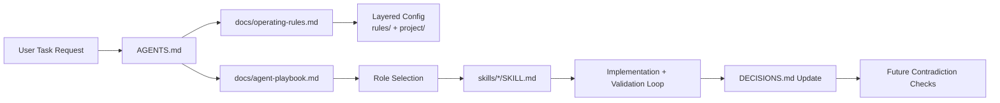

# CV Generator

A Go-powered CV generator with a multi-template web frontend. Fill in your details, choose a style, and download a polished PDF or Word document in seconds.

## Features

- **Three template styles**
  - **Simple** — clean modern layout for Western CVs
  - **Japan 履歴書 (Rirekisho)** — structured grid layout following the Japanese Rirekisho format (basic CV with personal info, work history, education); includes Japan-specific fields (birth date, gender, nationality)
  - **Japan 職務経歴書 (Shokumu Keirekisho)** — detailed professional resume for engineers; emphasizes project details, technical skills categorization, and work contributions
- **Two output formats**: PDF and Word (.docx)
- **Sections**: personal info, professional summary, work experience (with optional detailed project/role/tech stack for 職務経歴書), education, skills (simple or categorized), and languages
- **Go backend** — single stateless binary, no database required
- **Vanilla JS frontend** — no build step, served directly by the Go server

## Quick Start

### Prerequisites

- **Go 1.21+**
- **Chromium** (for PDF generation) — `chromium` or `google-chrome` must be on `PATH`
- **Noto Sans CJK** fonts (for Japanese/Chinese/Korean characters in PDFs)

On Debian/Ubuntu:

```bash
sudo apt-get install -y chromium fonts-noto-cjk
```

```bash
# 1. Build the server
cd backend
go build -o cv-generator .

# 2. Run the server (serves frontend automatically)
FRONTEND_DIR=../frontend ./cv-generator
# Server starts on http://localhost:8080

# Override port:
PORT=3000 FRONTEND_DIR=../frontend ./cv-generator
```

Open **http://localhost:8080** in your browser.

> **Container / CI note**: set `CHROMEDP_NO_SANDBOX=1` when running as root (e.g., inside Docker) so Chromium can start without a user namespace sandbox.

## Development (no build step needed)

```bash
cd backend
FRONTEND_DIR=../frontend go run .
```

## Running Tests

```bash
cd backend
CHROMEDP_NO_SANDBOX=1 go test ./...
```

## API

`POST /api/generate`

**Request body** (JSON):

```json
{
  "name":        "Tanaka Yuki",
  "email":       "yuki@example.com",
  "phone":       "+81-90-1234-5678",
  "address":     "Tokyo, Japan",
  "website":     "https://example.com",
  "birth_date":  "1990-04-01",
  "gender":      "Female",
  "nationality": "Japanese",
  "summary":     "Senior Go engineer…",
  "experience":  [{
    "company": "Acme",
    "position": "Engineer",
    "start_date": "2020-01",
    "end_date": "",
    "description": "…",
    "project": "E-commerce Platform",           // Optional, for 職務経歴書
    "role": "Backend API design…",             // Optional, for 職務経歴書
    "tech_stack": ["Go", "PostgreSQL", "AWS"]  // Optional, for 職務経歴書
  }],
  "education":   [{ "institution": "Univ of Tokyo", "degree": "B.Eng", "field": "CS", "start_date": "2014-04", "end_date": "2018-03" }],
  "skills":      ["Go", "Docker", "SQL"],
  "tech_stack": {                              // Optional, for 職務経歴書
    "languages": ["Java", "Go", "TypeScript"],
    "frameworks": ["Spring Boot", "React"],
    "databases": ["PostgreSQL", "MongoDB"],
    "infrastructure": ["AWS", "Docker", "Kubernetes"],
    "tools": ["Git", "Jenkins", "JIRA"]
  },
  "languages":   [{ "name": "Japanese", "proficiency": "Native" }],
  "template":    "simple",
  "format":      "pdf"
}
```

**Response**: binary file download (`cv.pdf` or `cv.docx`)

| Field | Values |
|-------|--------|
| `template` | `"simple"` (default) · `"japan"` (履歴書) · `"shokumu"` (職務経歴書) |
| `format` | `"pdf"` (default) · `"word"` / `"docx"` |

### Template Comparison

| Template | Use Case | Key Features |
|----------|----------|--------------|
| **Simple** | Western-style CV | Modern two-column layout, section separators |
| **Japan 履歴書** | Japanese basic CV (Rirekisho) | Formal grid tables, Japan-specific personal fields (birth date, gender, nationality) |
| **Japan 職務経歴書** | Japanese detailed work history (Shokumu Keirekisho) | Emphasized work experience with project details, tech stack per job, categorized technical skills |

---

Start here in order:
0. `docs/rules-quickstart.md` (minimal rule load)
1. `AGENTS.md` (entrypoint)
2. `docs/operating-rules.md` (safety, scope, validation)
3. `docs/agent-playbook.md` (role routing and workflow)

Best for teams looking for: AI coding agent playbook, multi-agent software workflow, and documentation-driven engineering.

Reusable repository assets for AI-assisted software delivery:

- repo-wide agent rules
- project-level subagents
- reusable prompt templates
- reusable skills
- external-practice notes

This template is intentionally project-agnostic. Copy, adapt, and version it in any repository where you want stable agent behavior across planning, implementation, integration, review, and documentation.

## Quick Start (3 steps)

1. Copy this template into your repository (or create a repo from this template).
2. Edit the three source-of-truth files first: `AGENTS.md`, `docs/operating-rules.md`, and `docs/agent-playbook.md`.
3. Run your first task with the required workflow: discover -> triage -> plan (if needed) -> implement -> validate -> record decisions.

For first entry into a new repository, run `skills/on-project-start/SKILL.md` before implementation to confirm project-specific boundaries.

If you only do one thing on day one: keep `DECISIONS.md` updated so future agent runs can perform contradiction checks.

## Example: Complete Use Case

Use case: add a new repository rule that all API handlers must enforce request ID logging.

1. Update rule source: add the non-negotiable rule in `docs/operating-rules.md` under Project-specific constraints.
2. Align routing and role guidance: update `docs/agent-playbook.md` if any role ownership changes.
3. Sync tool instructions: update `.github/copilot-instructions.md` to keep tool-specific guidance consistent.
4. Record the decision: append a dated entry to `DECISIONS.md` with context, decision, alternatives, and constraints.
5. Validate consistency: ensure no contradiction between `AGENTS.md`, `docs/operating-rules.md`, and `docs/agent-playbook.md`.

Outcome: every future implementation task follows the same logging requirement with traceable reasoning.

## Copy and Paste Snippets

### 1) Task kickoff prompt

```text
Goal: [what to change]
Scope: [files/modules allowed]
Constraints: follow AGENTS.md and docs/operating-rules.md
Deliverable: proposal + implementation + validation results
```

### 2) Mandatory first-response compliance block

```text
Read set: [list of files read]
Scale: [SMALL|MEDIUM|LARGE] + reason
Workflow path: [small simplification | medium/large full path]
Checkpoint map: [plan approval, destructive actions, scope expansion]
```

### 3) Decision log entry template

```markdown
## YYYY-MM-DD: [Decision title]
- **Context**: Why this decision was needed
- **Decision**: What was decided
- **Alternatives considered**: What was rejected and why
- **Constraints introduced**: What future work must respect
```

## Architecture Diagram



## Layered Configuration

This template supports layered constraint files so teams can adapt behavior without rewriting one large rules file.

- `rules/global/` — core communication, coding, and security rules
- `rules/domain/` — domain-specific constraints (backend, cloud, frontend, etc.)
- `project/project-manifest.md` — project-local context and boundaries

When constraints conflict, follow precedence defined in `docs/operating-rules.md`: Project Context -> Domain Rules -> Global Rules.

For rule placement, same-layer conflict handling, and governance checks, see `docs/layered-configuration.md`.

For staged simplification and automation steps, see `docs/rule-optimization-plan.md`.

## End-to-End Flow

1. Discover context: read relevant code/docs and existing decisions.
2. Initialize (first entry only): run `on-project-start` to confirm boundaries.
3. Triage task scale: classify as Small, Medium, or Large using evidence.
4. Plan path: Small uses simplified path, Medium/Large uses full planning path.
5. Implement safely: keep scope tight and follow repository patterns.
6. Validate: run targeted checks/tests, fix, and repeat until stable.
7. Record durable state: update `DECISIONS.md` when behavior or architecture choices are made.

This flow is what makes the template useful in real teams: predictable output quality, lower drift, and faster onboarding.

## Search Keywords and Discoverability

This template is designed for teams searching for:

- AI coding agent playbook template
- GitHub Copilot repository instructions template
- multi-agent software workflow for planning and implementation
- documentation-driven engineering workflow
- decision log and contradiction-check workflow

If you maintain a fork, keep these phrases in your repository description and README summary so more users can discover and adopt your workflow.

## What this repository gives you

- a root `AGENTS.md` entrypoint
- reusable operating rules and routing rules
- project-level subagents for Claude-compatible tooling
- reusable prompt templates for any chat-based coding tool
- reusable skills you can adapt into your own agent ecosystem
- repo-wide Copilot instructions

## Current asset inventory

- Claude subagents: 8 (`.claude/agents/*.md`)
- Reusable skills: 12 (`skills/*/SKILL.md`)
- Source-of-truth docs: `AGENTS.md`, `docs/operating-rules.md`, `docs/agent-playbook.md`

## Example gallery

Use `examples/` for ready-to-adapt constraint profiles:

- `examples/high-security-mode.md`
- `examples/mvp-rapid-mode.md`
- `examples/legacy-maintenance.md`

## Required vs optional files

### Required

- `AGENTS.md`
- `docs/operating-rules.md`
- `docs/agent-playbook.md`

### Strongly recommended

- `DECISIONS.md`
- `ARCHITECTURE.md`
- `.github/copilot-instructions.md`
- `.claude/agents/`
- `skills/`
- `docs/agent-templates.md`

### Optional

- `prompt-budget.yml` — declare token budget and enabled/disabled roles per project
- `docs/example-task-walkthrough.md` — reference for expected output formats
- `docs/external-practices-notes.md`
- `docs/adoption-guide.md`

## Adoption path

1. Create a new repository from this template or copy the files into an existing repository.
2. Edit `AGENTS.md` to point at your repository-specific docs.
3. Edit `docs/operating-rules.md` with your real safety, testing, and review expectations.
4. Edit `docs/agent-playbook.md` so the role routing matches your stack.
5. Fill in `ARCHITECTURE.md` with your module map and data flow.
6. Keep, rename, or remove subagents in `.claude/agents/` based on the tools your team actually uses.
7. Keep, rename, or remove skills in `skills/` based on the workflows you repeat often.
8. Update `.github/copilot-instructions.md` so it reflects the same role model.
9. Keep `DECISIONS.md` active from day one so agents can run contradiction checks before planning/implementation.
10. Apply memory lifecycle rules from `skills/memory-and-state/SKILL.md` (archive stale decisions when thresholds are hit and use selective reads for active vs. archived decisions).
11. Optionally create `prompt-budget.yml` to declare which roles and skills are enabled for your project.

## Customization checklist

- Replace generic module labels with your actual modules.
- Add repository-specific safety rails, test commands, and release rules.
- Add or remove role definitions to match your delivery workflow.
- If your team does not use Claude-style subagents, keep the role names but remove `.claude/agents/`.
- If your team does not use Copilot instructions, remove `.github/copilot-instructions.md`.
- See `docs/adoption-guide.md` → Tool adapter reference for Cursor, Windsurf, and OpenAI API setup.

## Portability note

The role names in this template are conceptual first:

- `feature-planner`
- `backend-architect`
- `application-implementer`
- `ui-image-implementer`
- `integration-engineer`
- `documentation-architect`
- `risk-reviewer`

Some tools can map these directly to project subagents. Others cannot. In tools without native subagents, use the same role names through prompt templates, reusable skills, or repository instructions instead.
